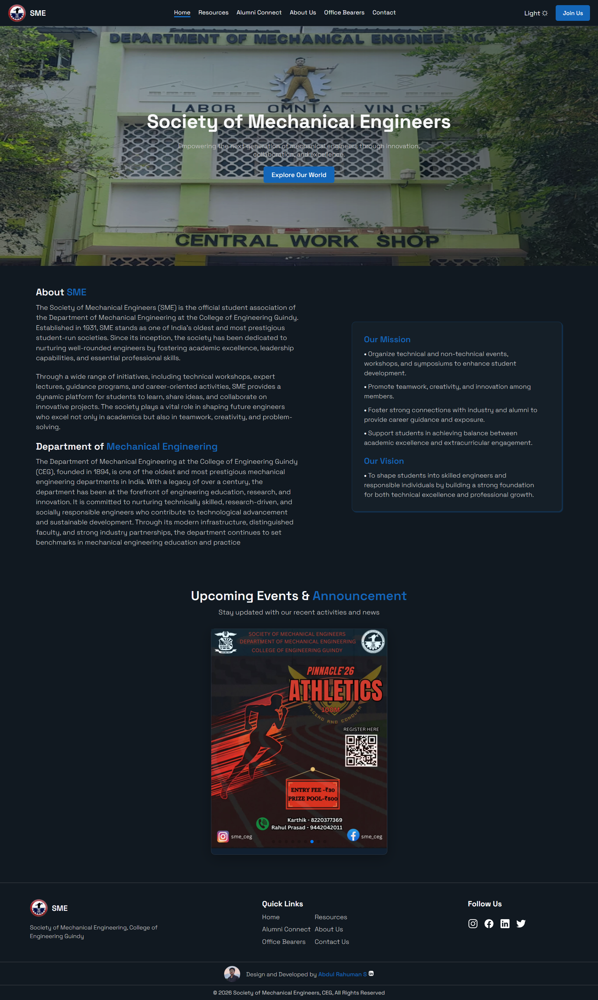
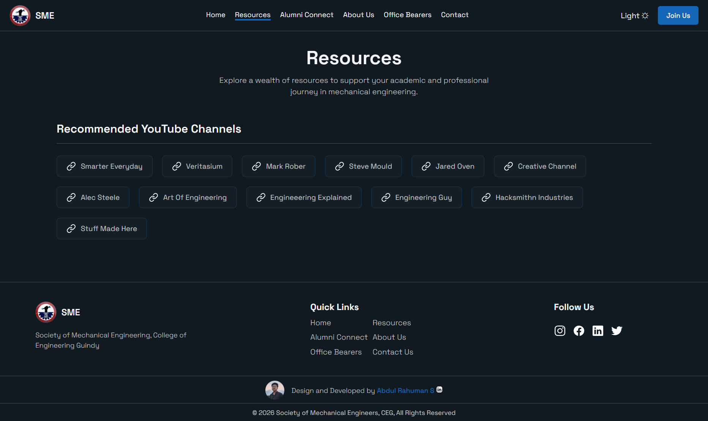
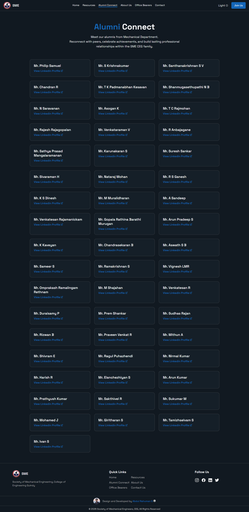
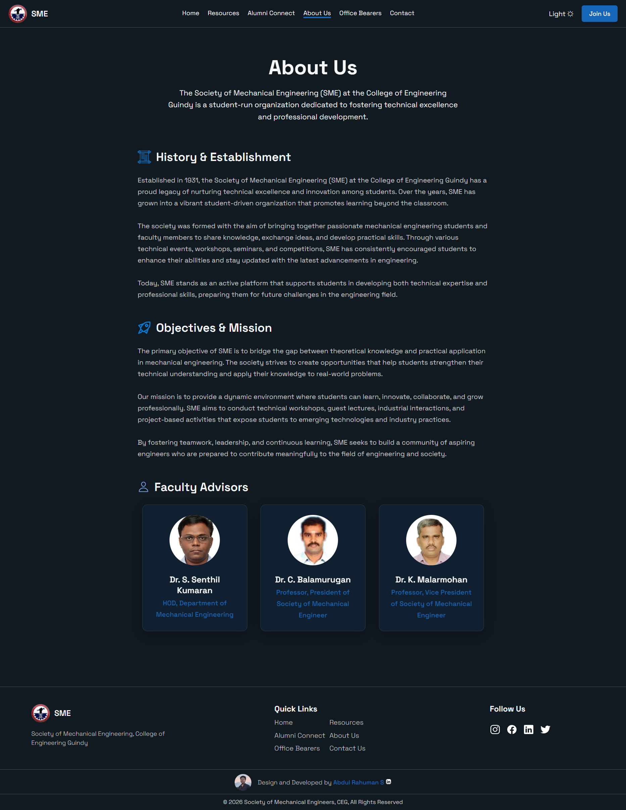
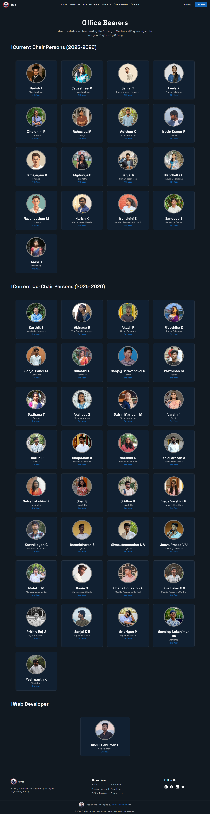
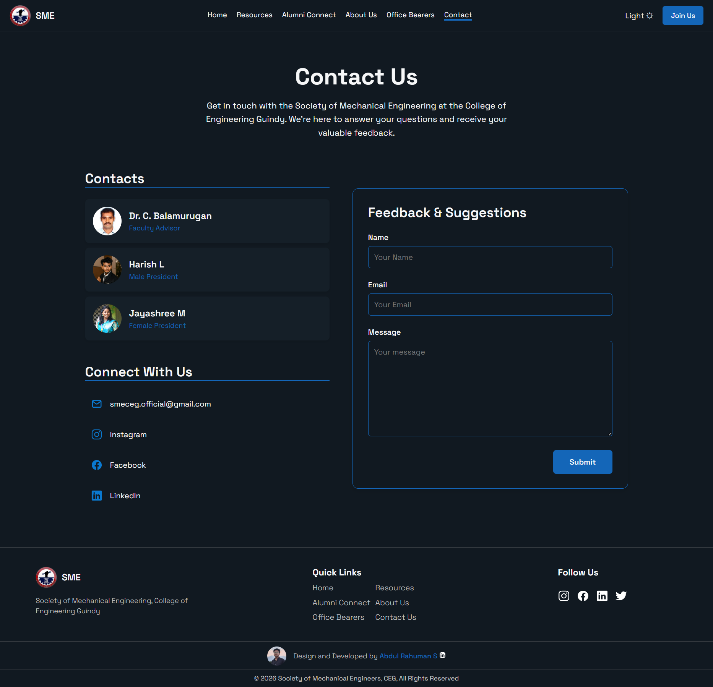

# ⚙️ SME — Society of Mechanical Engineers Website


> 🎓 **Official website developed for the Society of Mechanical Engineers (SME), College of Engineering, Guindy (CEG), Anna University.**

A modern, interactive, and fully responsive website developed for the **Society of Mechanical Engineers (SME)** to provide a centralized digital platform for showcasing the organization's activities, events, office bearers, alumni, resources, and departmental initiatives.

🌐 **Live Demo:** https://smeceg.vercel.app/

---

# 📸 Screenshots

## 🏠 Home


## 📖 Resources


## 🎓 Alumni


## 📓 About Us


## 👥 Office Bearers


## 📞 Contact


---

# About the Project

This website was developed as the **official digital platform** for the **Society of Mechanical Engineers (SME), College of Engineering, Guindy (CEG), Anna University**.

The objective of the project is to provide students, faculty members, alumni, and visitors with an engaging platform to explore the organization's activities, technical events, workshops, achievements, office bearers, learning resources, and departmental updates.

Alongside delivering a production-ready website for the organization, this project also helped me strengthen my frontend development skills by working on a real-world application with scalable architecture and modern UI/UX practices.

---

# Features

### Home

- Interactive landing page
- Hero section
- Responsive navigation
- Animated sections
- Organization overview

### Office Bearers

- Chairpersons
- Co-Chairpersons
- Executive Members
- Team structure
- Member profiles

### Alumni

- Alumni information
- Achievements
- Batch details


### Resources

- Study Materials
- Reference Resources
- Learning Materials
- Department Resources

### Contact

- Faculty Coordinators
- Club Contacts
- Department Information

### User Experience

- Fully Responsive Design
- Smooth Scroll Animations
- Modern UI
- Interactive Components
- Clean Navigation
- Professional Layout

---

# Technologies Used

- React.js
- JavaScript (ES6+)
- React Router DOM
- Vite
- CSS3
- GSAP
- AOS (Animate On Scroll)
- Three.js
- Swiper.js
- React Icons

---

# Responsiveness

The website is designed with a **mobile-first approach** and is fully responsive across:

- Desktop
- Laptop
- Mobile
- Tablet

Every page automatically adapts to different screen sizes to provide a smooth and consistent user experience.

---

# 🚀 Run Locally

Clone the repository

```bash
git clone https://github.com/Rahumansgit/SME.git
```

Navigate into the project

```bash
cd SME
```

Install dependencies

```bash
npm install
```

Start the development server

```bash
npm run dev
```

Build for production

```bash
npm run build
```

---

# What I Learned

Developing this project helped me improve my understanding of:

- Building scalable React applications
- Component-based architecture
- React Router for multi-page applications
- Responsive UI development
- Modern UI/UX design principles
- Three.js integration
- Reusable component design
- Organizing large frontend projects
- Deploying production-ready React applications

---

# Future Enhancements

- Admin Dashboard
- Dynamic Content Management
- Event Registration System
- Authentication & User Accounts
- Database Integration
- Search Functionality
- Gallery Module
- Analytics Dashboard

---


# Developer Note

Developing the official website for the **Society of Mechanical Engineers (SME), College of Engineering, Guindy (CEG), Anna University** was a valuable opportunity to work on a real-world project with practical requirements and organizational standards.

This project strengthened my expertise in **React.js**, **JavaScript**, **React Router**, **Three.js**, **GSAP**, and responsive web development while giving me hands-on experience in designing and developing a production-ready website for an official college organization.

It represents one of my most comprehensive frontend projects and reflects my passion for building modern, interactive, and user-friendly web applications.
